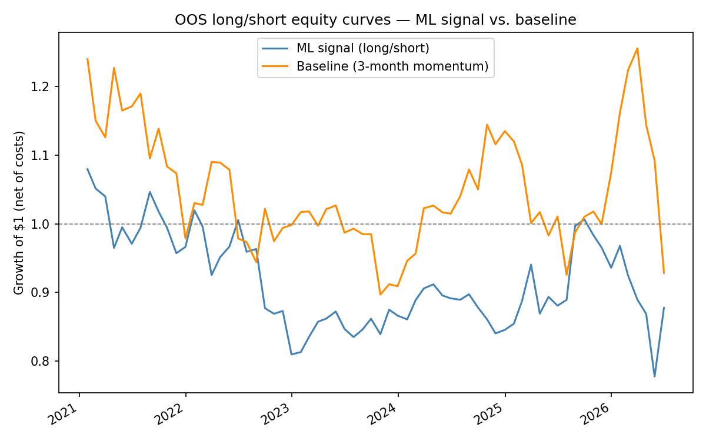
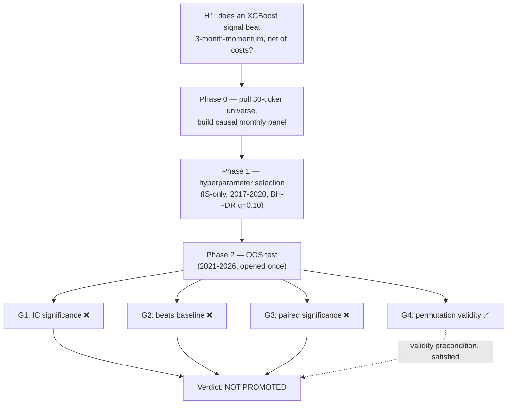
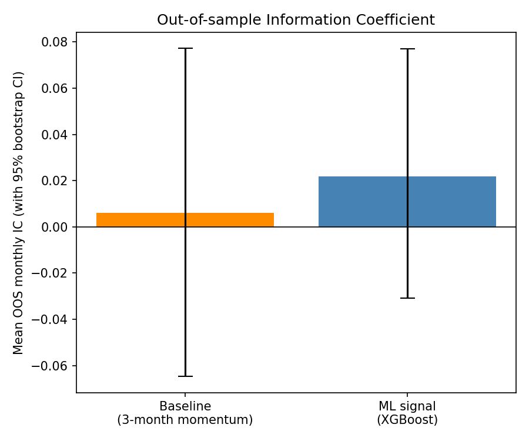

# Quant Research Lab — Does an ML Signal Beat a Hand-Crafted Momentum Rule?

**[▶ Live dashboard](https://yinshanlow-quant-research-lab.streamlit.app)** — the
pre-registration, both phase reports, and the figures, presented as a
browsable research report.

**Verdict: not promoted.** A pre-registered, falsification-first test of
whether a gradient-boosted (XGBoost) model combining five standard
cross-sectional equity factors produces genuine out-of-sample edge over a
single, unfit, hand-crafted 3-month momentum rule. Design (universe, factor
definitions, hyperparameter grid, promotion gates) was frozen and committed
to git before any real price data entered this repository. None of the four
gates the ML signal needed to clear were cleared.

> 30 large-cap US equities, 6 sectors · 2008–2026 (18.5y, IS 2008–2020 / OOS
> 2021–2026, 66 OOS months) · causal factors, block-bootstrap CIs, BH-FDR at
> the selection stage, paired significance test, label-permutation validity
> check · **OOS ML Sharpe −0.09 vs. baseline Sharpe +0.03** · 18 passing
> tests, synthetic fixtures only.

## TL;DR

- **What was tested.** H1: an XGBoost model combining 1/3/6-month momentum,
  21-day realized volatility, and 5-day reversal predicts next-month returns
  better than the cross-sectional z-score of 3-month momentum alone, net of
  a 10bps round-trip cost, on 30 large-cap US equities across 6 sectors,
  2008–2026 — [`preregistration/PREREGISTRATION.md`](preregistration/PREREGISTRATION.md).
- **Verdict table (OOS, 2021-01 → 2026-06, 66 months, opened once):**

  | Gate | Result | Pass? |
  |---|---|---|
  | G1 — IC significance | mean IC 0.0218, 95% CI **[−0.031, 0.077]** | FAIL |
  | G2 — beats baseline | ML Sharpe **−0.089** vs. baseline Sharpe **+0.029** | FAIL |
  | G3 — paired significance | mean Δreturn −0.0016, 95% CI **[−0.019, 0.017]** | FAIL |
  | G4 — permutation validity | permuted IC 95% CI **[−0.047, 0.073]** (includes 0, as required) | PASS |

  Full numbers: [`reports/PRIMARY_REPORT.md`](reports/PRIMARY_REPORT.md), [`reports/primary_report.json`](reports/primary_report.json).

- **G4 passing is what makes the null trustworthy.** A model trained on
  randomly shuffled labels shows no more skill than chance — the pipeline
  isn't leaking information, so "not promoted" is a real result, not an
  artifact of a broken backtest.
- **This retests, properly, a finding from the sibling
  [`quant-finance-toolkit`](../quant-finance-toolkit) repo**, where the same
  kind of ML-vs-baseline comparison was run on 4 tickers over 5 years — too
  small a sample to trust either direction. This study reruns the same
  question on a real cross-sectional universe with pre-registration,
  bootstrap CIs, multiple-testing correction, and a locked OOS window. The
  answer came out the same way, now with real statistical weight behind it.



*Figure 1 — Growth of $1, OOS only, net of costs. The baseline (orange) is
choppy but round-trips back near 1.0 across most of the window; the ML
signal (blue) drifts and stays below 1.0 for most of 2022–2026.*

## The arc



## An honest nuance worth surfacing, not smoothing over

The raw OOS mean IC is actually *higher* for the ML signal (0.022) than for
the baseline (0.006) — see Figure 2. But **neither CI excludes zero**, and
the ML signal's realized long-short portfolio Sharpe is *worse* than the
baseline's despite the nominally higher IC. IC measures rank correlation
across the whole cross-section; the tercile long-short book only cares about
getting the extremes right. A signal can look marginally better by one
measure and worse by the one that actually pays — which is exactly why this
study pre-registered **three** different gates (IC, Sharpe, paired
difference) rather than picking whichever single metric told the nicer
story after the fact.



*Figure 2 — mean OOS monthly IC with 95% bootstrap CI. Both bars' whiskers
span zero — neither signal shows a statistically real cross-sectional
ranking edge in this sample.*

## Why the hyperparameter selection stage already hinted at this

None of the four pre-registered XGBoost configurations produced a
significant (or even positive-and-robust) IC on the 2017–2020 in-sample
validation window — full table in
[`reports/SELECTION_REPORT.md`](reports/SELECTION_REPORT.md). Per the
pre-registered fallback rule, the least-bad config (B) was still carried
forward into the locked OOS test, honoring the process even though the
in-sample signal already looked weak. That's the discipline the whole study
is built around: the OOS test runs regardless of how discouraging the IS
selection stage looks, and the verdict is whatever the locked window says,
not whatever the researcher expected going in.

## Methodology spine

- **Pre-registration before data.** Hypothesis, universe, factor
  definitions, the full hyperparameter grid, and all four promotion gates
  were committed to git (`e15e200`) before `runners/run_00_fetch_data.py`
  ever ran — [`preregistration/PREREGISTRATION.md`](preregistration/PREREGISTRATION.md).
- **No look-ahead, proven by tests, not asserted.**
  `tests/test_features_no_lookahead.py` and
  `tests/test_ml_signal_no_lookahead.py` are truncation-invariance tests —
  recomputing a factor or a walk-forward prediction on a history truncated
  at date t must reproduce the exact value at t; corrupting data strictly
  after t must change nothing at or before t.
- **Walk-forward only.** The model is refit annually on an expanding window
  using only `date < cutoff` rows, both during IS-only hyperparameter
  selection and during the real OOS test (`src/ml_signal.py::walk_forward_predict`).
- **Block bootstrap, not naive resampling.** Every confidence interval
  resamples whole months, not individual (date, ticker) rows — cross-
  sectional observations within a month aren't independent of each other
  (`src/stats.py`).
- **Multiple-testing correction at the selection stage.** Benjamini-Hochberg
  FDR at q=0.10 across the 4 hyperparameter configs, before any of them ever
  saw OOS data.
- **A dedicated leakage sanity check (G4).** Shuffling the label within each
  month's cross-section before training and confirming the resulting IC is
  statistically indistinguishable from zero is what makes the "not
  promoted" verdict trustworthy rather than a possible symptom of a bug.

## What this means, and what it doesn't

**What it does mean:** on this specific 30-stock, large-cap, US-only
universe, over this specific 2021–2026 OOS window, a standard XGBoost
combination of five off-the-shelf factors does not produce a statistically
or economically real edge over simply ranking by 3-month momentum, net of
realistic costs. That's a complete, honestly-reported, negative result — and
the same conclusion the smaller `quant-finance-toolkit` test reached, now
confirmed with real statistical weight rather than a single small-sample
comparison.

**What it doesn't mean:** that ML signals never work in equities, that this
exact factor set is the best available, or that a larger/different universe,
a different label horizon, or a different model class would fail the same
way. See §8 of the pre-registration for the full, explicit scope
limitations.

## Repository layout

- `preregistration/` — the frozen design ([`PREREGISTRATION.md`](preregistration/PREREGISTRATION.md)) and its deviations log ([`DEVIATIONS.md`](preregistration/DEVIATIONS.md) — empty; nothing about the research design changed after freezing).
- `src/` — the engine: `data.py` (fetch + provenance manifest), `universe.py` (the fixed ticker list), `features.py` (causal factors), `baseline.py`, `ml_signal.py` (walk-forward XGBoost), `backtest.py` (long/short portfolio construction), `stats.py` (bootstrap, BH-FDR, IC, Sharpe).
- `tests/` — 18 tests, synthetic fixtures only, including the truncation-invariance no-look-ahead suite and the statistical-toolbox self-checks (pure noise → null, planted effect → detected).
- `runners/` — the four phase scripts, run in order: `run_00_fetch_data.py` → `run_01_select_hyperparams.py` (IS-only) → `run_02_oos_promotion.py` (the locked OOS test, run once) → `run_03_figures.py`.
- `reports/` — runner-generated, immutable: `SELECTION_REPORT.md`, `PRIMARY_REPORT.md`, `primary_report.json`, `figures/`.
- `data/` — gitignored except `MANIFEST.json` (per-ticker provenance: row count, date range, fetch timestamp, SHA-256 of the cached file).

## Reproduce

```bash
git clone <this-repo-url> && cd quant-research-lab
python3 -m venv .venv && source .venv/bin/activate
pip install -r requirements.txt

python -m pytest tests/ -v                      # 18 tests, synthetic fixtures, a few seconds

python -m runners.run_00_fetch_data             # pulls real Yahoo Finance data (~10s)
python -m runners.run_01_select_hyperparams     # IS-only, 2017-2020
python -m runners.run_02_oos_promotion          # THE locked OOS test — opens 2021+ once
python -m runners.run_03_figures
```

## Related research

Sibling project: [`quant-finance-toolkit`](../quant-finance-toolkit) — the
original 4-ticker version of this comparison lives in its
`ai_augmented/signal_model.py`, alongside options pricing, portfolio risk
(VaR/CVaR with a Kupiec backtest), and a C++ performance module. That
project covers breadth across classical and AI-augmented quant finance
topics; this one goes deep on a single hypothesis with the falsification
discipline a breadth-first toolkit can't fit into any one module.

## Disclaimer

All price data is real (Yahoo Finance, adjusted close). This is a research
and educational project, not investment advice. The signal studied here was
found to have no confirmable edge over the baseline and must not be traded.
